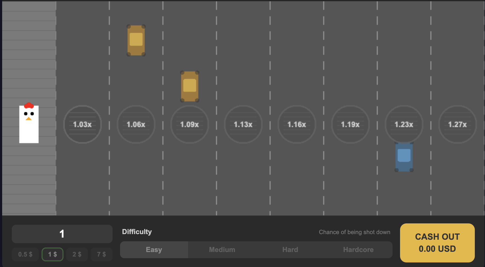

# Road Crosser

**[Live Demo](https://vei66rus.github.io/road-crosser/)**

Imitation of the popular "Chicken Road" iGaming mechanic built with PixiJS 8 + TypeScript.

This is a **portfolio project** demonstrating front-end game development skills. No real money is involved — all balances and bets are simulated.



## Gameplay

A chicken stands on the sidewalk. The road ahead has 30 lanes, each hiding either a safe passage or a car underneath a manhole cover.

- Click on the next manhole to move the chicken forward
- If the lane is safe — a barrier appears and the multiplier grows
- If a car is hiding — game over, the chicken gets squished
- Cash out at any time to collect your winnings (bet × current multiplier)
- Reach the finish sidewalk on the other side to win the maximum payout

### Difficulty

| Level    | Car Chance | Multiplier Growth |
|----------|-----------|-------------------|
| Easy     | 8%        | ×1.03 per lane    |
| Medium   | 18%       | ×1.06 per lane    |
| Hard     | 30%       | ×1.10 per lane    |
| Hardcore | 45%       | ×1.15 per lane    |

Higher difficulty means higher risk but exponentially higher multipliers.

## Tech Stack

- **PixiJS 8** — 2D WebGL rendering
- **TypeScript** — strict typing
- **Vite** — build tool & dev server

## Architecture

```
src/
  main.ts                 Entry point
  config/
    constants.ts          Layout, colors, animation parameters
    difficulty.ts         Difficulty configs, multiplier generation
  core/
    GameEngine.ts         State machine, game logic, camera
  entities/
    Road.ts               Background, lane dividers, sidewalks
    Chicken.ts            Character rendering & jump animation
    Lane.ts               Manhole, car, barrier per lane
    LaneManager.ts        Manages all 30 lanes
    Traffic.ts            Decorative passing cars
  ui/
    HUD.ts                Coin, multiplier badge, status text
    UIBridge.ts           HTML panel ↔ game engine binding
  utils/
    math.ts               Utility functions
```

## Run

```bash
npm install
npm run dev
```

Opens at `http://localhost:8080`
